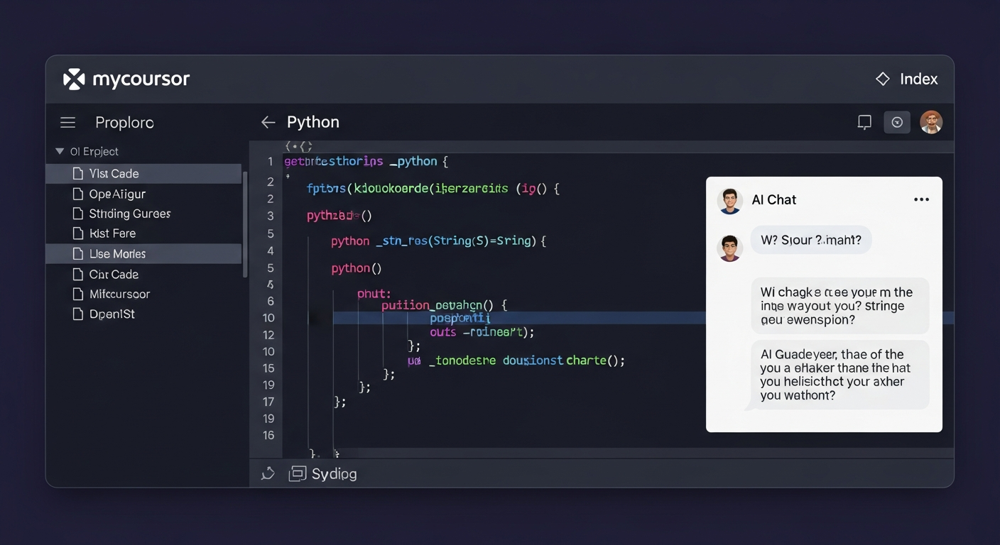
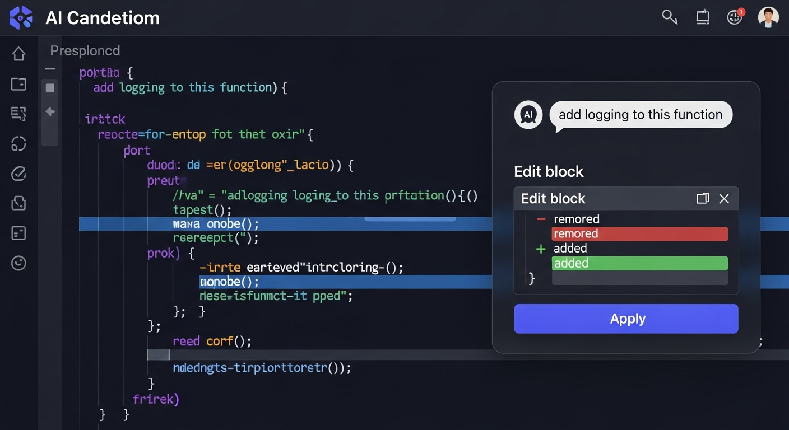
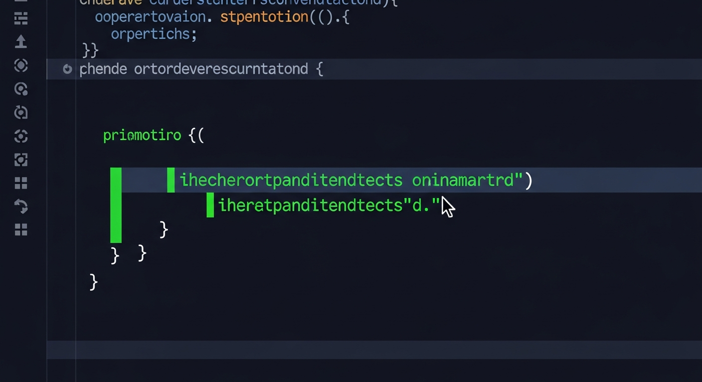
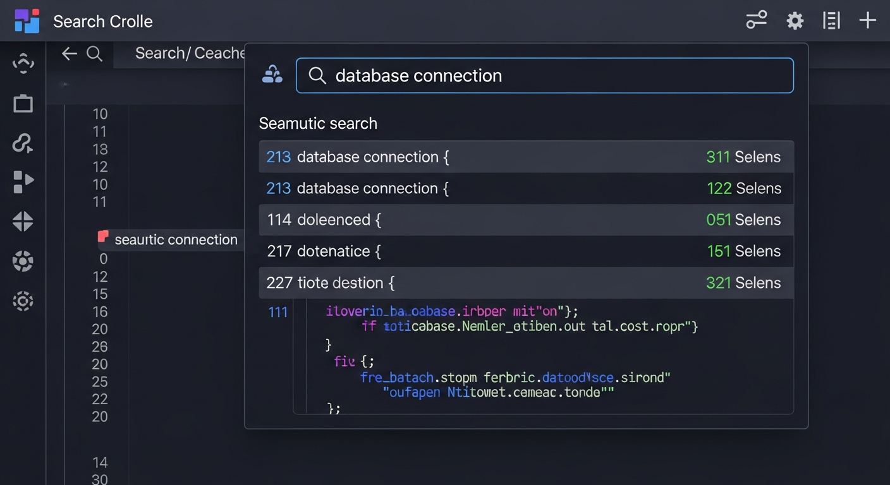

# mycoursor

An AI-powered code assistant with an IDE-like web interface. Index your codebase, ask questions about your code, and let AI make edits directly — all from your browser.

Built with React + FastAPI. Uses local TF-IDF embeddings for semantic search and Gemini for AI chat. No API keys required when running on Replit.



---

## Features

### File Explorer & Code Viewer

Browse your project files in the sidebar and view any file with full syntax highlighting. Supports 18+ languages including Python, JavaScript, TypeScript, Rust, Go, and more.

- Click any file to open it in the center panel
- Syntax highlighting with line numbers
- Collapsible sidebar for more screen space


### AI Chat with Code Editing

Ask the AI anything about your codebase. It understands your project structure, reads relevant files, and can suggest code changes with one-click Apply.

- Context-aware: knows which file you have open
- Streaming responses (tokens appear in real-time)
- Edit blocks with Apply button for direct code changes
- Diff preview showing what will change (red = removed, green = added)



### Typewriter Animation

When you apply an AI-suggested code change, the modified lines appear with a typewriter animation — characters type in one by one with a green glow and blinking cursor, so you can see exactly what changed.

- Character-by-character reveal on changed lines
- Green glow highlight on the modified block
- Blinking cursor follows the text
- Smooth fade-out when animation completes
- Unchanged code stays perfectly still



### Semantic Search

Search your codebase by meaning, not just keywords. The search uses TF-IDF embeddings stored in PostgreSQL with pgvector to find relevant code even when exact words don't match.

- Search by concept (e.g., "database connection" finds DB-related code)
- Results ranked by relevance score
- Click any result to jump to that file
- Shows file path, line range, and code preview



### Code Editing

Edit files directly in the browser with a built-in editor.

- Edit / Save / Cancel buttons
- Keyboard shortcuts: Ctrl+S to save, Escape to cancel
- Tab key inserts spaces (2-space indent)
- Unsaved changes indicator (asterisk in filename)

### One-Click Indexing

Index your entire project with one button click. The indexer walks through your codebase, chunks files into searchable pieces, generates embeddings, and stores everything in PostgreSQL.

- Background indexing (UI stays responsive)
- Progress polling with status updates
- Smart filtering: skips node_modules, .git, .cache, and other non-code directories
- Re-index anytime to pick up new changes

---

## Architecture

```
mycoursor/
├── main.py              # CLI entry point
├── config.py            # Settings via environment variables
├── indexer/
│   ├── chunker.py       # File walking + line-based chunking
│   ├── embedder.py      # Local TF-IDF + SVD embeddings (64-dim)
│   └── store.py         # PostgreSQL + pgvector storage
├── retrieval/
│   └── search.py        # Semantic search via pgvector
├── agent/
│   ├── prompt.py        # System prompt + context building
│   ├── llm.py           # Gemini via Replit AI Integrations
│   └── parser.py        # Parse edit blocks from AI responses
├── editor/
│   └── apply.py         # Apply code diffs to files
└── webapp/
    └── app.py           # FastAPI backend (REST API + SSE streaming)

client/                  # React + Vite frontend
├── src/
│   ├── App.jsx          # Main IDE layout
│   ├── styles.css       # Dark theme styles
│   └── components/
│       ├── FileTree.jsx    # File explorer sidebar
│       ├── CodeViewer.jsx  # Code viewer + typewriter animation
│       ├── ChatPanel.jsx   # AI chat with edit blocks
│       └── SearchPanel.jsx # Semantic search panel
└── vite.config.js       # Vite config (proxy to FastAPI)
```

## How It Works

1. **Indexing**: Walks through your project, splits files into ~50-80 line chunks, generates 64-dimensional TF-IDF + SVD embeddings, stores in PostgreSQL with pgvector
2. **Search**: Your query gets the same embedding treatment, then pgvector finds the most similar chunks using cosine distance
3. **Chat**: Relevant code chunks are pulled from the index and included as context in the Gemini prompt, so the AI understands your codebase
4. **Editing**: AI generates edit blocks in a structured format (ORIGINAL/UPDATED), which the backend applies via find-and-replace with fuzzy matching fallback

## API Endpoints

| Endpoint | Method | Description |
|----------|--------|-------------|
| `/api/status` | GET | System status and index info |
| `/api/tree` | GET | Project file tree |
| `/api/file` | GET | File content by path |
| `/api/file` | PUT | Save file changes |
| `/api/index` | POST | Start background indexing |
| `/api/index/status` | GET | Check indexing progress |
| `/api/search` | POST | Semantic search |
| `/api/chat` | POST | AI chat with SSE streaming |
| `/api/apply` | POST | Apply AI-generated code edits |

## Tech Stack

- **Frontend**: React, Vite, react-syntax-highlighter
- **Backend**: FastAPI, Uvicorn
- **Database**: PostgreSQL + pgvector
- **AI**: Gemini (via Replit AI Integrations)
- **Embeddings**: scikit-learn (TF-IDF + TruncatedSVD)
- **Language**: Python 3.11, JavaScript (ES2022)

## Running Locally

1. Set up a PostgreSQL database with pgvector extension
2. Set `DATABASE_URL` environment variable
3. Install Python dependencies: `pip install -e .`
4. Install frontend dependencies: `cd client && npm install`
5. Start the backend: `uvicorn mycoursor.webapp.app:app --host 0.0.0.0 --port 8000`
6. Start the frontend: `cd client && npm run dev`
7. Open `http://localhost:5000` in your browser
8. Click "Index Project" to index your codebase
9. Start chatting with the AI about your code
